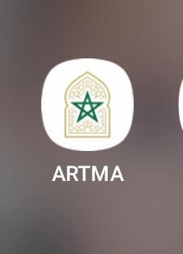
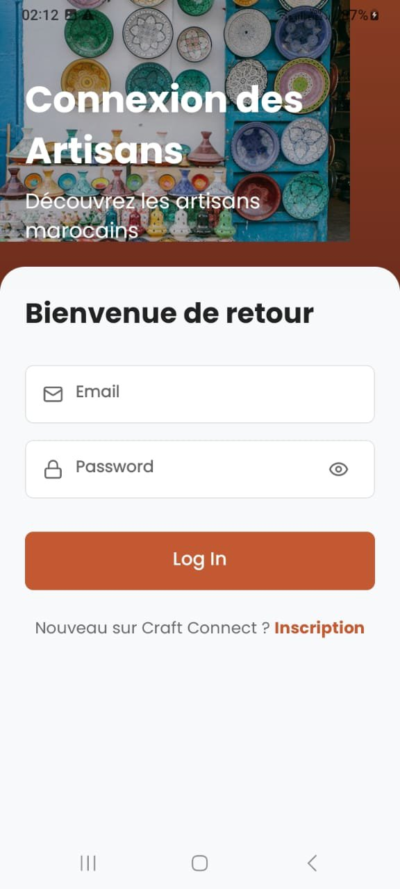

<div align="center">



# ArtMa — Artisanat Marocain

**Une marketplace mobile Android pour valoriser l'artisanat traditionnel marocain**
 

---



</div>

---

## 📖 Présentation

**ArtMa** (contraction de *Artisanat Marocain*) est une application mobile innovante conçue pour **numériser et dynamiser** le secteur de l'artisanat traditionnel au Maroc.

Elle met en relation directe les **artisans locaux** — souvent peu visibles dans le monde numérique — avec des **clients potentiels**, qu'ils soient particuliers ou professionnels, au Maroc et à l'international.

L'application répond à une ambition sociale forte : démocratiser l'accès au commerce en ligne pour les petits producteurs, tout en contribuant à la préservation du patrimoine culturel marocain.

## 🎥 Demo

## 🎥 Demo

[Voir la démo](https://raw.githubusercontent.com/houda884/ArtMA/main/Video%20ArtMA%20(1).mp4)


---

## ✨ Fonctionnalités principales

### 🔐 Authentification
- Inscription et connexion sécurisées
- Sélection du rôle : **Artisan** ou **Acheteur**

### 🛖 Espace Artisan
- Profil personnalisé avec photo et biographie
- Ajout, modification et suppression de produits
- Catégories disponibles : `boiserie` · `poterie` · `cuir` · `métal` · `bijoux` · `textile`
- Messagerie directe avec les clients

### 🛒 Espace Acheteur
- Navigation et recherche filtrée par catégories
- Vue détaillée des produits et profils artisans
- Système de favoris
- Paiement intégré par carte bancaire
- Avis et notation des artisans
- Chat en temps réel

### ⚙️ Autres
- Centre d'aide (FAQ)
- Politique de confidentialité
- Profil utilisateur éditable
- Suivi des commandes

---

## 🛠️ Technologies

| Technologie | Version | Rôle |
|---|---|---|
| React Native | — | Interface native mobile |
| Expo SDK | 52.0.30 | Framework principal |
| Expo Router | 4.0.17 | Navigation entre écrans |
| Context API | — | Gestion d'état global |
| AsyncStorage | — | Persistance des données locales |
| react-native-reanimated | — | Animations fluides |
| react-native-gesture-handler | — | Gestion des gestes tactiles |

---


## 📁 Architecture du projet

```tree
ArtMA/
├── app/
│   ├── (auth)/
│   │   ├── _layout.tsx
│   │   ├── login.tsx
│   │   └── signup.tsx
│   ├── (tabs)/
│   │   ├── _layout.tsx
│   │   ├── home.tsx
│   │   ├── categories.tsx
│   │   ├── chat.tsx
│   │   └── profile.tsx
│   ├── artisan/
│   │   └── [id].tsx
│   ├── product/
│   │   └── [id].tsx
│   ├── chat/
│   │   └── [id].tsx
│   ├── edit-profile.tsx
│   ├── favorites.tsx
│   ├── orders.tsx
│   ├── payment-methods.tsx
│   ├── help.tsx
│   └── privacy.tsx
├── components/
│   └── (composants réutilisables)
├── contexts/
│   └── (Context API — état global)
├── hooks/
│   └── (custom hooks)
├── utils/
│   └── (fonctions utilitaires)
├── assets/
│   └── (images, icônes, polices)
├── app.json
└── package.json
```

---

## 🚀 Installation et lancement

### Prérequis
- Node.js v18+
- npm ou yarn
- Application [Expo Go](https://expo.dev/client) sur smartphone

### Étapes

```bash
# 1. Cloner le projet
git clone https://github.com/your-username/artma.git
cd artma

# 2. Installer les dépendances
npm install

# 3. Lancer le serveur de développement
npx expo start
```

### Tester l'application

**Sur mobile** — Scanner le QR code avec Expo Go :
